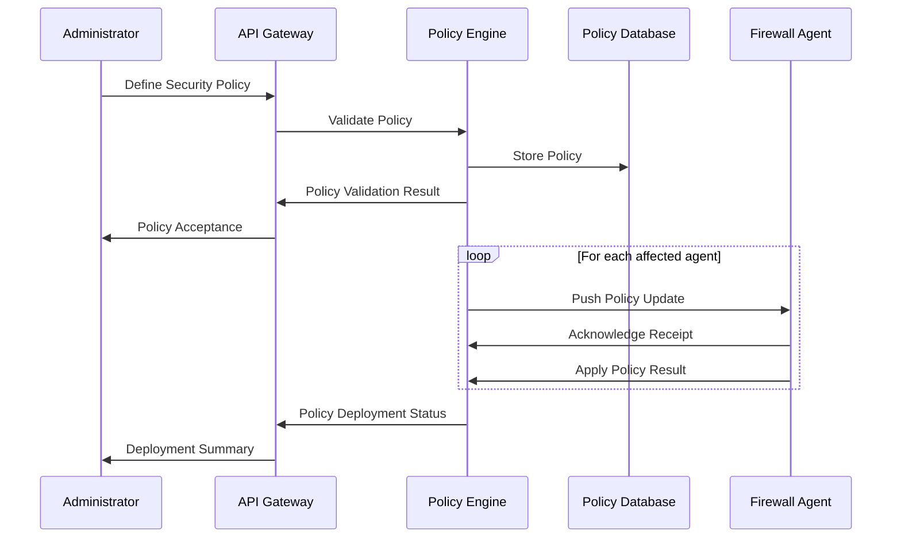

# System Architecture

## Table of Contents
1. [Architectural Overview](#1-architectural-overview)
2. [Component Architecture](#2-component-architecture)
3. [Data Flow](#3-data-flow)
4. [Deployment Architecture](#4-deployment-architecture)
5. [Security Architecture](#5-security-architecture)
6. [Scalability Considerations](#6-scalability-considerations)
7. [High Availability](#7-high-availability)
8. [Integration Points](#8-integration-points)

## 1. Architectural Overview

### 1.1 System Context
```
┌─────────────────────────────────────────────────────────────────────────┐
│                        External Systems                                 │
│  ┌─────────────┐  ┌─────────────┐  ┌─────────────────────────────────┐  │
│  │  SIEM       │  │  IDS/IPS    │  │  Cloud Services                │  │
│  │  Integration│  │  Integration│  │  (AWS/Azure/GCP)               │  │
│  └──────┬──────┘  └──────┬──────┘  └────────────────┬────────────────┘  │
│         │                │                          │                    │
└─────────┼────────────────┼──────────────────────────┼────────────────────┘
          │                │                          │
          ▼                ▼                          ▼
┌─────────────────────────────────────────────────────────────────────────┐
│                 Centralized Firewall Management System                 │
│  ┌───────────────────────┐  ┌───────────────────────────────────────┐  │
│  │  Management Plane     │  │  Data Plane                          │  │
│  │  - Policy Management  │  │  - Traffic Inspection                │  │
│  │  - Configuration     │  │  - Stateful Packet Filtering         │  │
│  │  - User Management   │  │  - Intrusion Prevention             │  │
│  └───────────┬──────────┘  └───────────────────┬───────────────────┘  │
│              │                                 │                      │
└──────────────┼─────────────────────────────────┼──────────────────────┘
               │                                 │
               ▼                                 ▼
┌─────────────────────────────────────────────────────────────────────────┐
│                        Protected Network                                │
│  ┌─────────────┐  ┌─────────────┐  ┌─────────────────────────────────┐  │
│  │  Web        │  │  Database   │  │  Application                   │  │
│  │  Servers    │  │  Servers    │  │  Servers                       │  │
│  └─────────────┘  └─────────────┘  └─────────────────────────────────┘  │
└─────────────────────────────────────────────────────────────────────────┘
```

### 1.2 Design Principles
- **Microservices Architecture**: Loosely coupled, independently scalable components
- **Zero Trust Security**: Verify explicitly, least privilege access
- **Defense in Depth**: Multiple security layers
- **Automation First**: Minimize manual intervention
- **Observability**: Comprehensive logging and monitoring

## 2. Component Architecture

### 2.1 Central Management Server

#### 2.1.1 API Gateway
- **Technology**: Kong/NGINX
- **Features**:
  - Request routing
  - Rate limiting
  - Authentication/Authorization
  - Request/Response transformation

#### 2.1.2 Policy Engine
- **Technology**: OPA (Open Policy Agent)
- **Features**:
  - Policy definition and validation
  - Conflict resolution
  - Version control integration

#### 2.1.3 Event Processor
- **Technology**: Apache Kafka, Apache Flink
- **Features**:
  - Real-time event processing
  - Complex event processing
  - Anomaly detection

### 2.2 Firewall Agent

#### 2.2.1 Packet Processor
- **Technology**: eBPF, XDP
- **Features**:
  - High-performance packet filtering
  - Protocol parsing
  - Connection tracking

#### 2.2.2 Policy Enforcer
- **Technology**: iptables/nftables
- **Features**:
  - Rule compilation
  - Stateful inspection
  - Connection tracking

## 3. Data Flow

### 3.1 Policy Deployment


### 3.2 Traffic Inspection
1. Packet arrives at network interface
2. Kernel-level filtering (XDP/eBPF)
3. Protocol analysis and normalization
4. Stateful inspection
5. Rule matching
6. Action execution (allow/deny/log)
7. Log generation and forwarding

## 4. Deployment Architecture

### 4.1 On-Premises Deployment
```
┌─────────────────────────────────────────────────────────┐
│                   Data Center                          │
│  ┌─────────────────┐  ┌─────────────────────────────┐  │
│  │  Management     │  │  Production Network         │  │
│  │  Network        │  │  ┌─────────┐  ┌─────────┐   │  │
│  │  ┌─────────┐    │  │  │  Agent  │  │  Agent  │   │  │
│  │  │ Central │    │  │  │  Node 1 │  │  Node 2 │   │  │
│  │  │ Server  │◄───┼──┼─►│         │  │         │   │  │
│  │  └─────────┘    │  │  └─────────┘  └─────────┘   │  │
│  └─────────────────┘  └─────────────────────────────┘  │
└─────────────────────────────────────────────────────────┘
```

### 4.2 Cloud Deployment
- **Kubernetes Operator**: For containerized environments
- **Auto-scaling Groups**: For dynamic workload scaling
- **Multi-region Deployment**: For global coverage
- **Serverless Components**: For event-driven processing

## 5. Security Architecture

### 5.1 Authentication & Authorization
- **Authentication**: OAuth 2.0 with JWT
- **Authorization**: ABAC (Attribute-Based Access Control)
- **MFA Support**: TOTP, U2F, WebAuthn
- **Certificate Management**: Automatic certificate rotation

### 5.2 Data Protection
- **Encryption**:
  - TLS 1.3 for data in transit
  - AES-256 for data at rest
  - Hardware Security Modules (HSM) for key management
- **Data Integrity**: HMAC-SHA256
- **Audit Logging**: Immutable blockchain-based logs

## 6. Scalability Considerations

### 6.1 Horizontal Scaling
- Stateless components can scale horizontally
- Database sharding for policy storage
- Distributed caching layer (Redis Cluster)

### 6.2 Performance Optimization
- Connection pooling
- Batch processing for logs and events
- Asynchronous processing for non-critical operations

## 7. High Availability

### 7.1 Active/Passive Failover
- Hot standby servers
- Automatic failover detection
- State synchronization

### 7.2 Data Replication
- Multi-AZ deployment
- Cross-region replication
- Point-in-time recovery

## 8. Integration Points

### 8.1 External Systems
- **SIEM Integration**: Splunk, ELK, QRadar
- **Ticketing Systems**: ServiceNow, Jira
- **Cloud Providers**: AWS, Azure, GCP
- **Identity Providers**: Okta, Azure AD, Keycloak

### 8.2 APIs
- **Management API**: RESTful API for system administration
- **Event API**: Webhook and streaming interfaces
- **Integration API**: For third-party tool integration

---
*Document Version: 1.0.0*  
*Last Updated: August 20, 2025*
