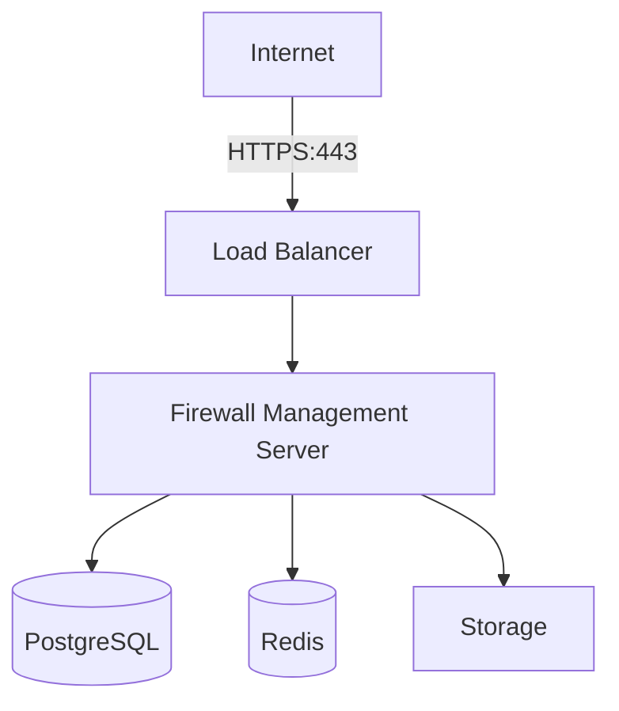
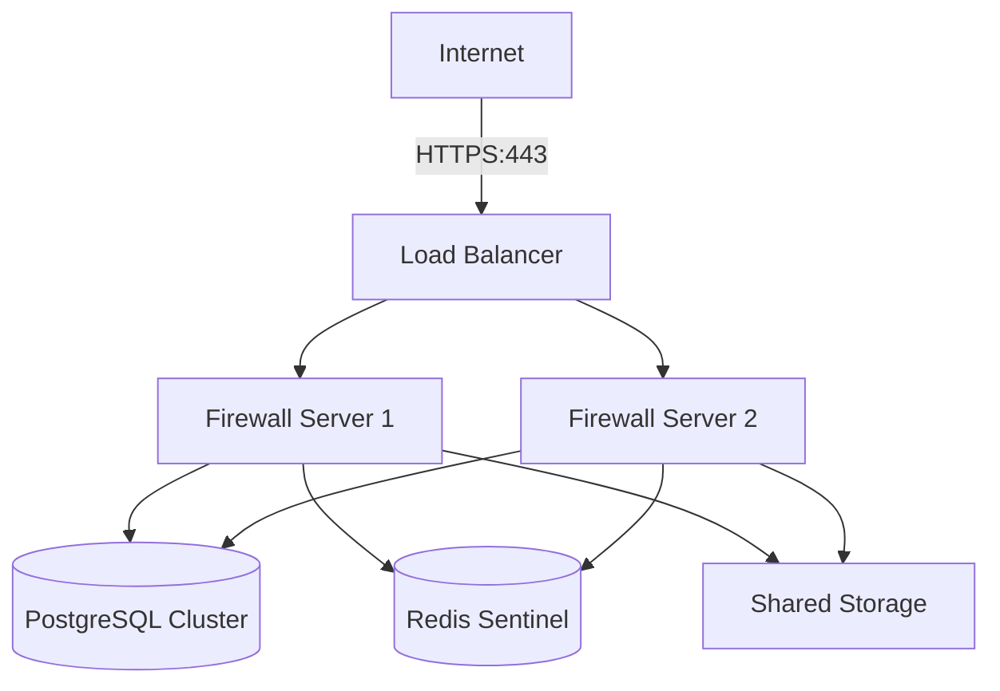

# Deployment & Operations Guide

## Table of Contents
1. [System Requirements](#1-system-requirements)
2. [Installation](#2-installation)
3. [Configuration](#3-configuration)
4. [Deployment Scenarios](#4-deployment-scenarios)
5. [Monitoring](#5-monitoring)
6. [Maintenance](#6-maintenance)
7. [Troubleshooting](#7-troubleshooting)
8. [Backup & Recovery](#8-backup--recovery)
9. [Scaling](#9-scaling)
10. [Upgrades](#10-upgrades)

## 1. System Requirements

### 1.1 Management Server
| Component | Minimum | Recommended | Production |
|-----------|---------|-------------|------------|
| CPU | 4 cores | 8 cores | 16+ cores |
| RAM | 8GB | 16GB | 32GB+ |
| Storage | 100GB | 500GB | 1TB+ (SSD) |
| OS | Ubuntu 20.04 LTS | Ubuntu 22.04 LTS | RHEL 9+ |
| Network | 1 Gbps | 10 Gbps | 2x 10 Gbps |

### 1.2 Firewall Agent
| Component | Minimum | Recommended |
|-----------|---------|-------------|
| CPU | 2 cores | 4+ cores |
| RAM | 2GB | 4GB+ |
| Storage | 10GB | 50GB+ |
| OS | Linux kernel 4.19+ | Linux kernel 5.15+ |
| Network | 1 Gbps | 10 Gbps |

## 2. Installation

### 2.1 Prerequisites
```bash
# Update system packages
sudo apt update && sudo apt upgrade -y

# Install required dependencies
sudo apt install -y \
    curl \
    gnupg \
    apt-transport-https \
    ca-certificates \
    software-properties-common

# Add repository signing key
curl -fsSL https://download.docker.com/linux/ubuntu/gpg | sudo gpg --dearmor -o /usr/share/keyrings/docker-archive-keyring.gpg

# Add Docker repository
echo "deb [arch=amd64 signed-by=/usr/share/keyrings/docker-archive-keyring.gpg] https://download.docker.com/linux/ubuntu $(lsb_release -cs) stable" | sudo tee /etc/apt/sources.list.d/docker.list > /dev/null

# Install Docker and Docker Compose
sudo apt update
sudo apt install -y docker-ce docker-ce-cli containerd.io docker-compose-plugin

# Add current user to docker group
sudo usermod -aG docker $USER
newgrp docker
```

### 2.2 Server Installation
```bash
# Create project directory
mkdir -p /opt/firewall-management
cd /opt/firewall-management

# Clone the repository
git clone https://github.com/yourorg/centralized-firewall.git .

# Copy example environment files
cp .env.example .env
cp docker-compose.override.example.yml docker-compose.override.yml

# Edit configuration
nano .env

# Start services
docker-compose up -d

# Verify services
docker-compose ps
docker-compose logs -f
```

## 3. Configuration

### 3.1 Environment Variables
```env
# Database
POSTGRES_USER=firewall_admin
POSTGRES_PASSWORD=your_secure_password
POSTGRES_DB=firewall_management

# Redis
REDIS_PASSWORD=your_redis_password

# Application
SECRET_KEY=your_secret_key
ALLOWED_HOSTS=.example.com,localhost,127.0.0.1
DEBUG=false

# Email
EMAIL_HOST=smtp.example.com
EMAIL_PORT=587
EMAIL_USE_TLS=true
EMAIL_HOST_USER=admin@example.com
EMAIL_HOST_PASSWORD=your_email_password
DEFAULT_FROM_EMAIL=firewall@example.com

# Security
SESSION_COOKIE_SECURE=true
CSRF_COOKIE_SECURE=true
SECURE_SSL_REDIRECT=true
SECURE_HSTS_SECONDS=31536000
SECURE_HSTS_INCLUDE_SUBDOMAINS=true
SECURE_HSTS_PRELOAD=true
```

### 3.2 Network Configuration
```yaml
# Example network configuration for Docker
networks:
  frontend:
    driver: bridge
    driver_opts:
      com.docker.network.driver.mtu: 1500
    ipam:
      config:
        - subnet: 172.20.0.0/16
          gateway: 172.20.0.1
```

## 4. Deployment Scenarios

### 4.1 Single Server Deployment


### 4.2 High Availability Deployment


## 5. Monitoring

### 5.1 Prometheus Configuration
```yaml
# prometheus.yml
global:
  scrape_interval: 15s
  evaluation_interval: 15s

scrape_configs:
  - job_name: 'firewall_management'
    static_configs:
      - targets: ['firewall-management:8000']
    metrics_path: '/metrics'
    scheme: 'http'

  - job_name: 'node_exporter'
    static_configs:
      - targets: ['node-exporter:9100']

  - job_name: 'postgres_exporter'
    static_configs:
      - targets: ['postgres-exporter:9187']
```

### 5.2 Grafana Dashboards
- System Metrics
- Application Performance
- Security Events
- Network Traffic
- Database Performance
- API Latency

## 6. Maintenance

### 6.1 Backup Script
```bash
#!/bin/bash
# backup.sh

TIMESTAMP=$(date +%Y%m%d_%H%M%S)
BACKUP_DIR="/backups/firewall_$TIMESTAMP"

mkdir -p $BACKUP_DIR

# Backup PostgreSQL
docker exec -t postgres pg_dumpall -c -U postgres > $BACKUP_DIR/postgres_backup.sql

# Backup configuration files
cp -r /opt/firewall-management/config $BACKUP_DIR/
cp /opt/firewall-management/.env $BACKUP_DIR/

# Create archive
tar -czvf /backups/firewall_backup_$TIMESTAMP.tar.gz $BACKUP_DIR

# Cleanup
rm -rf $BACKUP_DIR

# Keep last 7 days of backups
find /backups -name "firewall_backup_*.tar.gz" -type f -mtime +7 -delete
```

## 7. Troubleshooting

### 7.1 Common Issues

#### Service Not Starting
```bash
# Check container logs
docker-compose logs -f service_name

# Check service status
docker-compose ps
docker ps -a

# Check resource usage
docker stats
```

#### Database Connection Issues
```bash
# Check if database is running
docker-compose exec postgres pg_isready

# Check connection from application
curl -X GET "http://localhost:8000/api/health"
```

## 8. Backup & Recovery

### 8.1 Backup Strategy
- **Full Backups**: Daily
- **Incremental Backups**: Hourly
- **Retention**: 30 days
- **Offsite Storage**: AWS S3/Google Cloud Storage

### 8.2 Recovery Procedure
```bash
# Stop services
docker-compose down

# Restore database
docker-compose exec -T postgres psql -U postgres < backup.sql

# Restore configuration
cp -r backup/config/* /opt/firewall-management/config/
cp backup/.env /opt/firewall-management/

# Start services
docker-compose up -d
```

## 9. Scaling

### 9.1 Horizontal Scaling
```yaml
# docker-compose.override.yml
version: '3.8'

services:
  api:
    deploy:
      replicas: 3
      resources:
        limits:
          cpus: '1'
          memory: 2G
        reservations:
          cpus: '0.5'
          memory: 1G
    healthcheck:
      test: ["CMD", "curl", "-f", "http://localhost:8000/health"]
      interval: 30s
      timeout: 10s
      retries: 3
```

## 10. Upgrades

### 10.1 Upgrade Procedure
1. **Preparation**
   - Review release notes
   - Backup current installation
   - Schedule maintenance window

2. **Deployment**
   ```bash
   # Pull latest changes
   git pull origin main
   
   # Update images
   docker-compose pull
   
   # Migrate database
   docker-compose run --rm api python manage.py migrate
   
   # Restart services
   docker-compose up -d --force-recreate
   ```

3. **Verification**
   - Check service status
   - Run smoke tests
   - Verify monitoring

4. **Rollback**
   ```bash
   # Revert to previous version
   git checkout v1.2.3
   docker-compose up -d --force-recreate
   ```

---
*Document Version: 1.0.0*  
*Last Updated: August 20, 2025*
